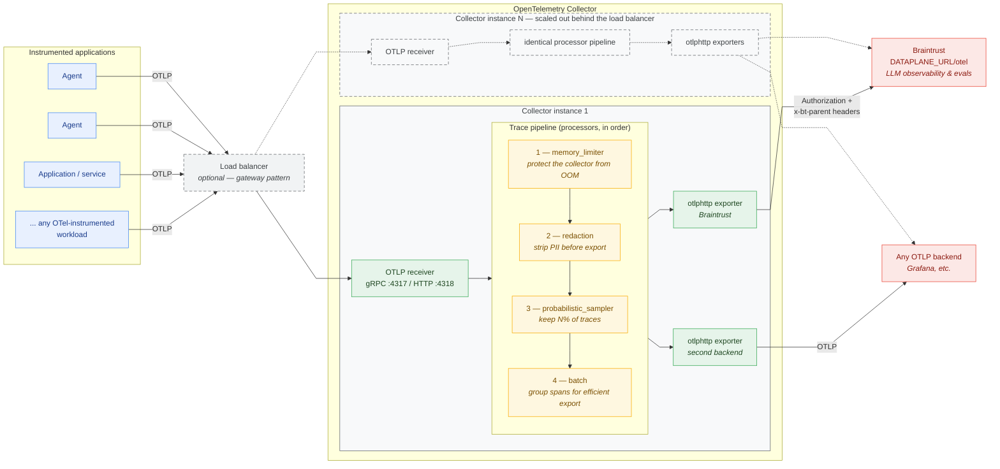

# Braintrust + OpenTelemetry Collector Patterns

A complete, runnable example showing how to route LLM agent traces through an
OpenTelemetry Collector to **both Grafana and Braintrust** — with PII redaction
and probabilistic sampling applied at the collector before any backend receives
data.

**Who this is for:** teams that already run an OTel Collector (or the Grafana
LGTM stack) and want to add Braintrust for LLM-specific observability without
ripping out their existing infrastructure.

---

## Architecture

The diagram below shows the general pattern this repo demonstrates: any number
of OTel-instrumented applications and LLM agents emit OTLP to a single
collector, which redacts PII, samples, and fans the surviving spans out to
Braintrust **and** any other OTLP-compatible backend (this repo ships Grafana
LGTM, but Datadog, Honeycomb, etc. work identically — only the exporter block
changes).



> The diagram source also lives standalone at
> [`docs/architecture.mmd`](docs/architecture.mmd) for sharing and rendering
> outside this README (see the comments at the top of that file).

The dashed elements are the [gateway-pattern](https://opentelemetry.io/docs/collector/deploy/gateway/)
scale-out: in production, applications send to a load balancer fronting
multiple identical collector instances rather than to one sidecar. In this
repo the applications talk to a single sidecar collector directly, so you can
mentally delete the dashed boxes — nothing in `collector.yaml` changes either
way.

**What processors do:** a processor sits between receivers and exporters and
can transform, filter, enrich, or drop telemetry in flight; they run in
exactly the order listed in the pipeline. Only two of the four here implement
this example's headline features — `redaction` (PII) and
`probabilistic_sampler`. The other two are operational hygiene you should run
on any production collector: `memory_limiter` refuses new data when the
collector's own heap approaches its limit so the process doesn't OOM (it must
be first, before any work is done), and `batch` groups spans into fewer,
larger export requests (it goes last, so batches are formed only from spans
that survived sampling). Because every span passes through this chain *before*
reaching any exporter, both backends receive identically redacted and sampled
data — there is no path by which raw PII reaches a vendor.

### Deployment pattern: agent (sidecar) vs. gateway

The OpenTelemetry docs describe two standard ways to deploy a collector:

- **[Agent pattern](https://opentelemetry.io/docs/collector/deploy/agent/)** —
  the collector runs *alongside* the application (sidecar container, DaemonSet,
  or same host). The SDK sends OTLP to this local collector, which exports to
  one or more backends. It is straightforward to get started with and gives a
  clear one-to-one mapping between application and collector.
- **[Gateway pattern](https://opentelemetry.io/docs/collector/deploy/gateway/)** —
  applications send telemetry to a single, centrally managed OTLP endpoint
  (one or more standalone collector instances per cluster/region). This buys
  centrally managed credentials and centralized policy (filtering, sampling)
  at the cost of an extra hop and more operational surface.

**This repo uses the agent pattern**: the collector is a sidecar container in
the same Docker Compose network as the workload. Everything in
`collector.yaml`, however, is deployment-agnostic — the same pipeline
(redaction → sampling → fan-out) is exactly what you would centralize in a
gateway tier. PII redaction and tail-based sampling are in fact *stronger*
arguments for a gateway in production: the gateway docs specifically call out
applying "trace sampling policies consistently" and centralized policy
management as reasons to adopt it, and tail sampling requires all spans of a
trace to reach the same collector instance.

### Trace hierarchy (what you see in each backend)

```
banking-support-session          ← Python root span (manual OTel)
├── turn-1                       ← manual OTel turn span (contains PII attributes)
├── turn-2
├── turn-3
└── turn-4
```

The `banking-support-session` and `turn-N` spans are created manually using the
OpenTelemetry SDK to demonstrate PII redaction at the attribute level. The
OpenAI Agents SDK runs inside each turn and produces its own agent-run and
LLM-generation spans, which are exported to OpenAI's tracing backend by default.
See the `set_trace_processors` stub in `agent.py` to redirect those spans to your
OTel collector instead.

---

## Components

### 1. Grafana LGTM stack (`grafana/otel-lgtm`)

A single Docker image that bundles:
- **Grafana** — visualization and dashboards (port 3000)
- **Tempo** — distributed tracing backend (accepts OTLP)
- **Prometheus** — metrics storage
- **Loki** — log aggregation
- Its own internal OTel Collector that routes incoming OTLP data to the above

We run this as-is (no custom config mount) and forward processed spans from
our standalone collector to its OTLP HTTP receiver.

[[Grafana docker-otel-lgtm documentation]](https://grafana.com/docs/opentelemetry/docker-lgtm/)

### 2. Standalone OTel Collector (`otel/opentelemetry-collector-contrib`)

The `otelcol-contrib` image includes all community processors and exporters,
including `redactionprocessor` and `probabilisticsamplerprocessor`. We run this
as a separate container so our pipeline configuration is completely visible and
editable in `collector.yaml`, independent of LGTM's internal wiring.

The [OTel component model](https://opentelemetry.io/docs/collector/components/)
defines five component types, all of which you wire together in `collector.yaml`:

| Component type | Role | Used in this repo |
|----------------|------|-------------------|
| **Receivers** | Collect telemetry from various sources and formats | `otlp` (gRPC + HTTP) |
| **Processors** | Transform, filter, and enrich telemetry between receipt and export | `memory_limiter`, `redaction`, `probabilistic_sampler`, `batch` |
| **Exporters** | Send telemetry to observability backends | `otlphttp/braintrust`, `otlphttp/grafana` |
| **Connectors** | Join two pipelines, acting as both exporter and receiver (e.g., derive metrics from spans) | not used — stub in `collector.yaml` |
| **Extensions** | Capabilities outside the data path, like health checks | `health_check` |

Processors run **in the order listed in the pipeline**, and every exporter only
sees data that has passed through the full chain. That ordering is what makes
the PII story work: the `redaction` processor sits between the receiver and the
exporters, so sensitive attribute values are replaced with `*****` before
*either* backend — Braintrust or your second vendor — receives a single byte.
The redaction and sampling processors live in the
[contrib distribution](https://github.com/open-telemetry/opentelemetry-collector-contrib),
which is why this repo uses `otelcol-contrib` rather than the core image.

Specific components used here:

| Component | What it does |
|-----------|-------------|
| **receiver** `otlp` | Accepts spans/metrics/logs over gRPC (4317) and HTTP (4318) |
| **processor** `memory_limiter` | Monitors heap usage; drops new data if limits are exceeded to prevent OOM crashes. Must be first in every pipeline. |
| **processor** `redaction` | Matches span attribute values against regex patterns and replaces matches with `*****`. Runs before any exporter sees the data. |
| **processor** `probabilistic_sampler` | Drops a configurable fraction of traces using a hash of the trace ID. Head-based: the decision is made on the first span. |
| **processor** `batch` | Groups spans into batches to reduce export overhead. Must be last in the processor chain (after sampling). |
| **exporter** `otlphttp/braintrust` | Sends traces to `https://api.braintrust.dev/otel` with `Authorization` and `x-bt-parent` headers. |
| **exporter** `otlphttp/grafana` | Sends traces to the LGTM container's internal OTLP receiver on the Docker network. |
| **fan-out** | Listing both exporters in `service.pipelines.traces.exporters` causes the collector to send an independent copy to each. |

[[OTel Collector architecture]](https://opentelemetry.io/docs/collector/architecture/)  
[[OTel Collector configuration]](https://opentelemetry.io/docs/collector/configuration/)

### 3. OpenAI Agents SDK (`openai-agents`)

The agent is built with the [OpenAI Agents SDK](https://openai.github.io/openai-agents-python/),
a Python library for building multi-turn AI agents using OpenAI models.

Key SDK concepts used here:

- **`Agent`** — defines the model, name, and system instructions (`instructions` becomes the system prompt).
- **`Runner.run_sync()`** — executes the agent synchronously for one conversational turn. Accepts the full message history so the model has context from prior turns.
- **`result.final_output`** — the agent's text reply for the current turn.
- **`result.to_input_list()`** — returns the updated conversation history (including the assistant reply) ready to pass to the next `run_sync()` call.

The SDK has its own built-in tracing that, by default, exports agent-run and
LLM-generation spans to OpenAI's tracing API. This is separate from the OTel
collector pipeline. To disable the SDK's tracing or redirect it to your own OTLP
backend, use `set_trace_processors()` — see the stub in `agent/agent.py`.

[[OpenAI Agents SDK documentation]](https://openai.github.io/openai-agents-python/)  
[[OpenAI Agents SDK tracing]](https://openai.github.io/openai-agents-python/tracing/)  
[[OpenAI Agents SDK running agents]](https://openai.github.io/openai-agents-python/running_agents/)

### 4. Braintrust OTLP integration and trace propagation

Braintrust accepts standard OTLP at `<DATAPLANE_URL>/otel`, where
`DATAPLANE_URL` is your deployment's API URL — for self-hosted/hybrid
deployments this is your stack's Universal API URL; for SaaS it is
`https://api.braintrust.dev` (EU: `https://api-eu.braintrust.dev`).
Two HTTP headers are required on every request,
and in this repo the collector's `otlphttp/braintrust` exporter attaches them
so applications never handle Braintrust credentials:

```
Authorization: Bearer <BRAINTRUST_API_KEY>
x-bt-parent: project_name:braintrust-otelcol-examples
```

The `x-bt-parent` header controls **where in Braintrust the trace lands** —
it names the parent container for every span in the request. It accepts:

- `project_id:<id>` or `project_name:<name>` — route into a project's logs
- `experiment_id:<id>` — attach spans to an experiment
- a span slug from `span.export()` — nest the incoming trace under a specific
  existing span (distributed tracing across services)

Two propagation rules to keep in mind:

1. **Within a trace**, parent/child structure is ordinary OTel context
   propagation — `trace_id` and `parent_span_id` on each span. The collector
   forwards these untouched, so the hierarchy you build in your app (root
   session span → per-turn spans → LLM spans) appears verbatim in Braintrust.
2. **Every trace needs a root span.** Braintrust's logs table only shows
   traces whose root span was ingested (`span_parents` empty). If you sample
   or filter in the collector, do it per-trace (as the trace-ID-hashing
   `probabilistic_sampler` here does), not per-span — orphaned child spans
   won't appear in the UI.

If an app exports to Braintrust **directly** (no collector), the same two
headers move into standard SDK environment variables instead:

```
OTEL_EXPORTER_OTLP_ENDPOINT=<DATAPLANE_URL>/otel
OTEL_EXPORTER_OTLP_HEADERS="Authorization=Bearer <API key>, x-bt-parent=project_name:braintrust-otelcol-examples"
```

[[Braintrust OTLP configuration]](https://www.braintrust.dev/docs/integrations/sdk-integrations/opentelemetry#otlp-configuration)

### 5. PII redaction (`redactionprocessor`)

The `redaction` processor in `collector.yaml` is configured with two layers:

- **`blocked_key_patterns`** — any attribute whose key matches one of these anchored
  regexes (e.g. `^customer\\.credit_card$`) has its value replaced with `*****`
  unconditionally. Use this for well-known PII fields where you control the key name.
- **`blocked_values`** — regex patterns applied to every attribute value; any matching
  substring is replaced with `*****`. Use this for free-text attributes (e.g.
  `turn.prompt`) where PII may appear inline.

Both layers fire before any exporter sees the data, so Braintrust and Grafana
receive only the redacted version.

The `summary: debug` setting logs a per-span audit trail of what was redacted
(visible in collector logs). Change to `info` or `silent` for production.

[[Redaction processor documentation]](https://github.com/open-telemetry/opentelemetry-collector-contrib/blob/main/processor/redactionprocessor/README.md)

### 6. Probabilistic sampling

`probabilistic_sampler` with `sampling_percentage: 50` keeps approximately half
of all incoming traces. The same trace ID always gets the same decision
(controlled by `hash_seed`), so sampling is consistent across restarts.

This is **head-based sampling** — the decision is made when the first span of a
trace arrives. If you need to sample based on the full trace content (e.g.,
always keep error traces), replace this with `tail_sampling` from
`otelcol-contrib`. See the stubs in `collector.yaml`.

Set `sampling_percentage: 100` during development to see all traces.

---

## Prerequisites

- **Docker** and **Docker Compose** v2+
- **Python 3.11+**
- **Braintrust API key** — [create one here](https://www.braintrust.dev/app/settings?tab=api-keys)
- **OpenAI API key** — [create one here](https://platform.openai.com/api-keys)

---

## Quick Start

### 1. Configure API keys

```bash
cp .env.example .env
# Edit .env and fill in BRAINTRUST_API_KEY and OPENAI_API_KEY
```

### 2. Start the infrastructure

```bash
docker compose up -d
```

This starts two containers:
- `lgtm` — Grafana UI at [http://localhost:3000](http://localhost:3000) (admin/admin)
- `collector` — OTEL Collector on ports 4317 (gRPC) and 4318 (HTTP)

Wait ~10 seconds for the containers to be ready. Check with:
```bash
docker compose logs collector --tail=20
```

### 3. Install Python dependencies

Create an isolated virtual environment to avoid `externally-managed-environment`
errors on modern Python installations (PEP 668):

```bash
cd agent
python3 -m venv .venv
source .venv/bin/activate   # Windows: .venv\Scripts\activate
pip install -r requirements.txt
```

The `.venv` directory is excluded from version control via `.gitignore`.

### 4. Run the agent

```bash
# Activate the venv if it isn't already active:
source agent/.venv/bin/activate   # Windows: agent\.venv\Scripts\activate

# From the agent/ directory:
cd agent
python agent.py
```

The agent runs a 4-turn banking support conversation, each turn sending a
customer message that contains PII. The collector redacts the PII before
forwarding spans to either backend.

### 5. View traces

**Grafana:**
1. Open [http://localhost:3000](http://localhost:3000) (admin/admin)
2. Go to **Explore** → select **Tempo** datasource
3. Search by service name `acme-bank-support-agent`

**Braintrust:**
1. Open [https://www.braintrust.dev](https://www.braintrust.dev)
2. Navigate to project **braintrust-otelcol-examples**
3. View traces in the **Logs** tab

**Collector self-metrics:**
```bash
curl http://localhost:8888/metrics | grep otelcol_exporter_sent_spans
```
You should see non-zero counts for both `braintrust` and `grafana` exporters.

### 6. Stop the infrastructure

```bash
docker compose down
```

---

## Extending the Example

### Add a new observability backend

1. Add an exporter section to `collector.yaml`:
   ```yaml
   exporters:
     otlphttp/honeycomb:
       endpoint: https://api.honeycomb.io
       headers:
         x-honeycomb-team: "${HONEYCOMB_API_KEY}"
   ```
2. Add the exporter to the relevant pipeline(s) under `service.pipelines`.
3. Add `HONEYCOMB_API_KEY` to `docker-compose.yaml` environment and your `.env`.

### Change the sampling rate

Edit `collector.yaml`:
```yaml
processors:
  probabilistic_sampler:
    sampling_percentage: 100  # keep all traces (development)
    # sampling_percentage: 10  # keep 10% (high-volume production)
```

### Switch to tail-based sampling

Replace the `probabilistic_sampler` block with `tail_sampling`:
```yaml
processors:
  tail_sampling:
    decision_wait: 10s
    policies:
      - name: keep-errors
        type: status_code
        status_code: {status_codes: [ERROR]}
      - name: probabilistic-rest
        type: probabilistic
        probabilistic: {sampling_percentage: 10}
```

Then update the pipeline to reference `tail_sampling` instead of `probabilistic_sampler`.

### Add more PII patterns

Add regex patterns to the `blocked_values` list in `collector.yaml`:
```yaml
processors:
  redaction:
    blocked_values:
      - "your-custom-pattern-here"
```

### Add more agent turns or a different task

Edit `TURNS` and `run_support_session()` in `agent/agent.py`. The `Runner.run_sync()`
call passes the full `input_messages` history each turn, so the model automatically
has context from all previous turns. Add entries to `TURNS` or change the
conversation topic without any other changes required.

### Switch to a different OpenAI model

Edit the `model` parameter in the `Agent(...)` constructor in `agent/agent.py`:
```python
agent = Agent(
    name="Ava",
    instructions=SYSTEM_PROMPT,
    model="gpt-4o",       # or gpt-4.1, gpt-4.1-mini, etc.
)
```
See [OpenAI models](https://platform.openai.com/docs/models) for the full list.

### Persist Grafana data across restarts

Uncomment the volume mount in `docker-compose.yaml`:
```yaml
services:
  lgtm:
    volumes:
      - lgtm-data:/data

volumes:
  lgtm-data:
```

---

## Troubleshooting

**No traces in Grafana:**
- Check collector logs: `docker compose logs collector`
- Verify the collector started: `curl http://localhost:13133/health`
- Check LGTM is accepting spans: `docker compose logs lgtm --tail=30`

**No traces in Braintrust:**
- Verify your `BRAINTRUST_API_KEY` in `.env`
- Check collector logs for export errors to `otlphttp/braintrust`
- Check `http://localhost:8888/metrics` for `otelcol_exporter_failed_spans`

**Agent exits without traces:**
- The `force_flush` timeout in `agent.py` is 5000ms; if the collector is slow,
  increase it.
- Run `docker compose ps` to confirm both containers are healthy.

**Sampling drops all my test traces:**
- Set `sampling_percentage: 100` in `collector.yaml` and restart the collector:
  `docker compose restart collector`

---

## References

All claims in this example are backed by the following official documentation:

| Source | URL |
|--------|-----|
| Braintrust OTel Python SDK | https://www.braintrust.dev/docs/integrations/sdk-integrations/opentelemetry |
| Braintrust OTLP configuration (`x-bt-parent`) | https://www.braintrust.dev/docs/integrations/sdk-integrations/opentelemetry#otlp-configuration |
| OpenAI Agents SDK | https://openai.github.io/openai-agents-python/ |
| OpenAI Agents SDK — running agents | https://openai.github.io/openai-agents-python/running_agents/ |
| OpenAI Agents SDK — tracing | https://openai.github.io/openai-agents-python/tracing/ |
| Grafana docker-otel-lgtm | https://grafana.com/docs/opentelemetry/docker-lgtm/ |
| OTel Collector architecture (fan-out) | https://opentelemetry.io/docs/collector/architecture/ |
| OTel Collector configuration | https://opentelemetry.io/docs/collector/configuration/ |
| OTel Collector components (receivers/processors/exporters/connectors/extensions) | https://opentelemetry.io/docs/collector/components/ |
| OTel Collector agent deployment pattern (sidecar) | https://opentelemetry.io/docs/collector/deploy/agent/ |
| OTel Collector gateway deployment pattern | https://opentelemetry.io/docs/collector/deploy/gateway/ |
| OTel Redaction Processor | https://github.com/open-telemetry/opentelemetry-collector-contrib/blob/main/processor/redactionprocessor/README.md |
| OTel Probabilistic Sampler | https://github.com/open-telemetry/opentelemetry-collector-contrib/blob/main/processor/probabilisticsamplerprocessor/README.md |
